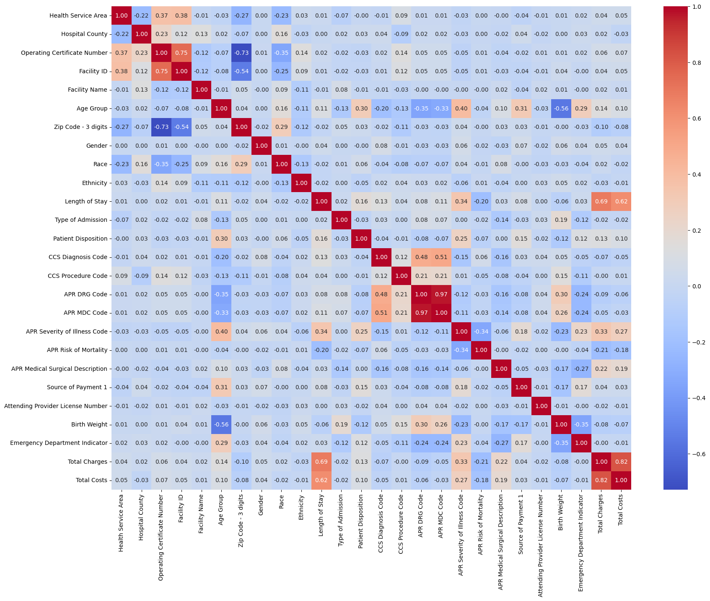
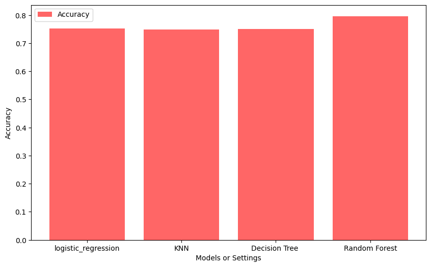
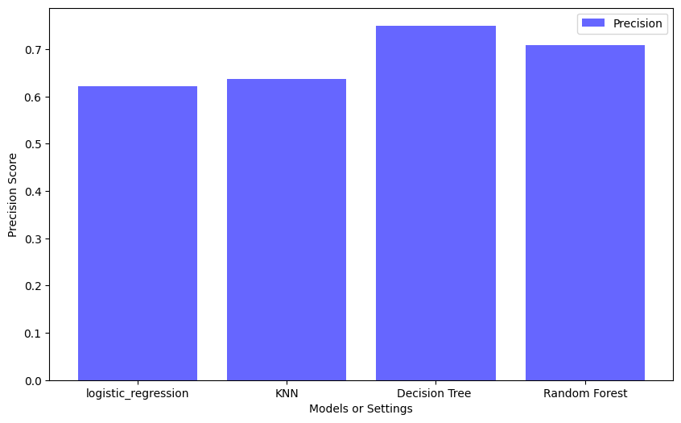
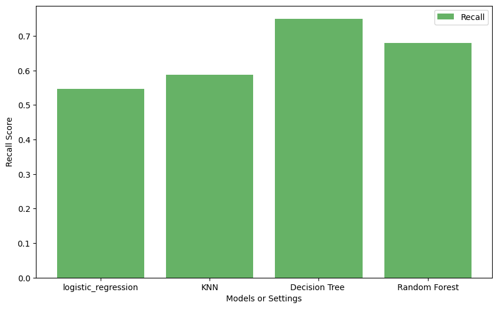
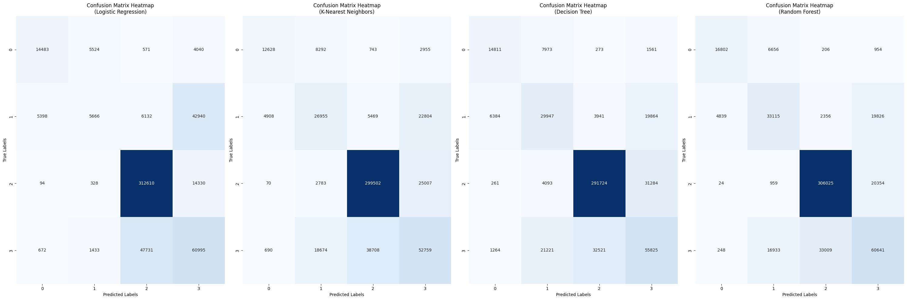

# Introduction to Data Mining Course Project 2

The Statewide Planning and Research Cooperative System (SPARCS) Inpatient De-identified dataset is a wealth of information, containing discharge level detail on various aspects of hospital inpatient discharges in New York State during the year 2010. From patient characteristics such as age group, gender, race and ethnicity to diagnoses, treatments, services and charges - all data elements excluding those consideredidentifiable have been made available within this dataset. This data does not contain any protected health information (PHI) under the Health Insurance Portability and Accountability Act (HIPAA). Understanding the plethora of details in this data can give individuals insights into many varying aspects related to hospital care. Dive into understanding more about what goes on behind closed doors at hospitals with the SPARCS Inpatient De-identified Dataset!

## Table of Contents


1. [Getting Started](#getting-started)
   - [Prerequisites](#prerequisites)
   - [Installation](#installation)
2. [Data Preprocessing](#data-preprocessing)
   - [Step 1: Data Loading](#step-1-data-loading)
   - [Step 2: Data Cleaning and Analysis](#step-2-Data-cleaning-and-analysis)
   - [step 3 : Data Transformation and Label Encoding](#Data-Transformation-and-Label-Encoding)
3. [Model Training and Evaluation](#model-training-and-evaluation)
   - [Logistic Regression](#logistic-regression)
   - [K-Nearest Neighbors (KNN)](#k-nearest-neighbors-knn)
   - [Decision Tree Classifier](#decision-tree-classifier)
   - [Random Forest Classifier](#random-forest-classifier)
4. [Model Comparison](#model-comparison)


## Getting Started


### Prerequisites

List the software and libraries required to run the project.

- Python
- Jupyter Notebook
- Libraries (e.g., pandas, numpy, scikit-learn)

### Installation

Provide instructions on how to install or set up the necessary software and libraries.

```bash
pip install jupyter
pip install pandas
pip install seaborn
pip install scikit-learn

```

In this section, we import the necessary Python libraries and modules for data analysis and machine learning. Each library has a specific purpose.


This setup prepares the environment for working with data and machine learning, importing libraries and modules commonly used for data analysis and model building. The 'warnings' filter is set to 'ignore' to maintain a cleaner output when running the code.


```python
import pandas as pd
import numpy as np
import matplotlib.pyplot as plt
import seaborn as sns
from sklearn.preprocessing import MinMaxScaler
from sklearn.model_selection import train_test_split,GridSearchCV
from sklearn.linear_model import LogisticRegression
from sklearn.neighbors import KNeighborsClassifier
from sklearn.tree import DecisionTreeClassifier
from sklearn.ensemble import RandomForestClassifier
from sklearn.metrics import precision_score, recall_score, confusion_matrix
```

## Data Preprocessing

Explain the data preprocessing steps performed in your project. Include code snippets with explanations.

### Step 1: Data Loading

```python

# Load the dataset
hospital_data = pd.read_csv('hospital-inpatient-discharges-sparcs-de-identified-2010-1.csv', low_memory=False)


### Step 2: Data Cleaning and Analysis


In this section, we perform exploratory data analysis (EDA) on the hospital dataset `hospital_data`. We are using various operations and visualizations to gain insights into the data and performing data cleaning and handle missing values in the `hospital_data` dataset.


#### Checking for Missing Values

We start by checking the number of missing values for each column in the original `hospital_data` DataFrame.


```python
hospital_data.isnull().sum()
```


    index                                        0
    Health Service Area                       4887
    Hospital County                           4887
    Operating Certificate Number              4887
    Facility ID                               4887
    Facility Name                                0
    Age Group                                    0
    Zip Code - 3 digits                       3201
    Gender                                       0
    Race                                         0
    Ethnicity                                    0
    Length of Stay                               0
    Type of Admission                            0
    Patient Disposition                        103
    Discharge Year                               0
    CCS Diagnosis Code                        2273
    CCS Diagnosis Description                 2273
    CCS Procedure Code                        2273
    CCS Procedure Description                 2273
    APR DRG Code                                 0
    APR DRG Description                          0
    APR MDC Code                                 0
    APR MDC Description                          0
    APR Severity of Illness Code                 0
    APR Severity of Illness Description        241
    APR Risk of Mortality                      241
    APR Medical Surgical Description             0
    Source of Payment 1                          0
    Source of Payment 2                     810381
    Source of Payment 3                    2040841
    Attending Provider License Number         4887
    Operating Provider License Number       670818
    Other Provider License Number          2133991
    Birth Weight                                 0
    Abortion Edit Indicator                      0
    Emergency Department Indicator               0
    Total Charges                                0
    Total Costs                                  0
    dtype: int64


#### Analyzing Different types of features
We explore the distribution of the different features by displaying the counts of its unique values.


```python
hospital_data['APR Risk of Mortality'].value_counts()
```

    APR Risk of Mortality
    Minor       1644151
    Moderate     554542
    Major        300829
    Extreme      122370
    Name: count, dtype: int64


```python
hospital_data['Discharge Year'].value_counts()
```

    Discharge Year
    2010    2622133
    Name: count, dtype: int64


#### Data Preprocessing
For further analysis, we create a new DataFrame hospital_data_final by dropping several columns that are not relevant to our analysis.


```python
hospital_data_final = hospital_data.drop(['Abortion Edit Indicator','Discharge Year','Other Provider License Number', 'Operating Provider License Number', 'Source of Payment 3', 'Source of Payment 2', 'index','CCS Diagnosis Description','CCS Procedure Description', 'APR DRG Description', 'APR MDC Description', 'APR Severity of Illness Description'], axis=1)
```


#### Handling Missing Values
Next, we create a new DataFrame, hospital_data_final, by dropping rows with missing values in specific columns, including 'Health Service Area,' 'CCS Diagnosis Code,' and 'APR Risk of Mortality.' This step helps us ensure that the dataset contains only the rows with complete information in these critical columns.


| Column Name                           | Missing Values |
|--------------------------------------|----------------|
| Health Service Area                   | 4,887          |
| Hospital County                       | 4,887          |
| Operating Certificate Number          | 4,887          |
| Facility ID                           | 4,887          |
| Attending Provider License Number     | 4,887          |

| Column Name                           | Missing Values |
|--------------------------------------|----------------|
| CCS Diagnosis Code                    | 2,273          |
| CCS Diagnosis Description             | 2,273          |
| CCS Procedure Code                    | 2,273          |
| CCS Procedure Description             | 2,273          |

| Column Name                           | Missing Values |
 |--------------------------------------|----------------|
 | APR Severity of Illness Description  | 241            |
 | APR Risk of Mortality Description    | 241            |

All this columns have null values in same rows  . so we decided to drop them 


```python
hospital_data_final = hospital_data_final.dropna(subset=['Health Service Area', 'CCS Diagnosis Code', 'APR Risk of Mortality'])
```


#### Handling Missing Values in 'Patient Disposition'
We start by analyzing the distribution of values in the 'Patient Disposition' column and display the counts of each unique value.
We fill missing values in the 'Patient Disposition' column with the value 'Home or Self Care' to provide a default disposition for records with missing information.


```python
hospital_data_final['Patient Disposition'].value_counts()
```


    Patient Disposition
    Home or Self Care                        1779863
    Home w/ Home Health Services              321491
    Skilled Nursing Home                      245913
    Left Against Medical Advice                56810
    Expired                                    56067
    Short-term Hospital                        47148
    Inpatient Rehabilitation Facility          44419
    Psychiatric Hospital or Unit of Hosp       15299
    Hospice - Medical Facility                  8619
    Another Type Not Listed                     8535
    Hospice - Home                              8530
    Facility w/ Custodial/Supportive Care       7280
    Cancer Center or Children's Hospital        5026
    Medicare Cert Long Term Care Hospital       3475
    Court/Law Enforcement                       3308
    Hosp Basd Medicare Approved Swing Bed       2041
    Federal Health Care Facility                 718
    Medicaid Cert Nursing Facility                46
    Critical Access Hospital                      44
    Name: count, dtype: int64


```python
hospital_data_final['Patient Disposition'] = hospital_data_final['Patient Disposition'].fillna('Home or Self Care')
```

#### Data Transformation: 'Zip Code - 3 digits'
Next, we perform transformations on the 'Zip Code - 3 digits' column. First, we replace any occurrences of 'OOS' with '000'. Then, we extract the first three digits from the remaining values.


```python
hospital_data_final['Zip Code - 3 digits'] = hospital_data_final['Zip Code - 3 digits'].replace('OOS', '000')
```


```python
hospital_data_final['Zip Code - 3 digits'] = hospital_data_final['Zip Code - 3 digits'].str[:3]
```

#### Analysis of 'Zip Code - 3 digits'
We analyze the distribution of values in the 'Zip Code - 3 digits' column and display the counts of each unique value


```python
hospital_data_final['Zip Code - 3 digits'].value_counts()
```


    Zip Code - 3 digits
    112    363089
    104    243067
    117    202368
    100    201460
    113    139537
    115    102190
    114     99958
    000     74129
    142     72205
    105     68472
    103     67927
    109     63410
    146     58400
    125     50496
    140     49891
    130     41087
    120     36700
    119     36674
    107     35472
    145     32411
    121     31875
    144     31428
    110     30818
    136     29869
    132     29731
    148     29171
    128     27337
    134     24615
    141     23735
    116     23470
    111     22881
    124     20976
    147     20795
    131     19465
    123     19009
    122     18986
    133     17664
    129     17292
    138     14849
    137     14793
    127     13877
    135     12150
    126     12082
    143     11301
    108     10702
    106     10169
    139      9488
    118      9268
    149      8448
    101      6348
    Name: count, dtype: int64


####  Handling Missing Values in 'Zip Code - 3 digits'
Lastly, we fill missing values in the 'Zip Code - 3 digits' column with the mode of the corresponding 'Zip Code - 3 digits' values for each 'Hospital County.'


```python
hospital_data_final['Zip Code - 3 digits'] = hospital_data_final['Zip Code - 3 digits'].fillna(hospital_data_final.groupby('Hospital County')['Zip Code - 3 digits'].transform(lambda x: x.mode().iloc[0]))
```


### step 3 : Data Transformation and Label Encoding

In this section, we perform data transformation and label encoding on selected columns in the `hospital_data_final` DataFrame. We also handle the 'Length of Stay' column.


#### Label Encoding

We use label encoding to transform categorical columns into numerical values for modeling. The following columns are encoded:
- 'Zip Code - 3 digits'
- 'Health Service Area'
- 'Hospital County'
- 'Facility Name'
- 'Gender'
- 'Race'
- 'Ethnicity'
- 'Type of Admission'
- 'Patient Disposition'
- 'APR Risk of Mortality'
- 'APR Medical Surgical Description'
- 'Source of Payment 1'
- 'Emergency Department Indicator'
- 'Age Group'


```python
hospital_data_final[['Zip Code - 3 digits','Health Service Area','Hospital County','Facility Name','Gender','Race','Ethnicity','Type of Admission','Patient Disposition','APR Risk of Mortality','APR Medical Surgical Description','Source of Payment 1','Emergency Department Indicator','Age Group']] = hospital_data_final[['Zip Code - 3 digits','Health Service Area','Hospital County','Facility Name','Gender','Race','Ethnicity','Type of Admission','Patient Disposition','APR Risk of Mortality','APR Medical Surgical Description','Source of Payment 1','Emergency Department Indicator','Age Group']].apply(LabelEncoder().fit_transform)
```

#### Data Transformation: 'Length of Stay'
To handle the 'Length of Stay' column, we first identify and replace a specific value 'a' with '120' (an example for illustration).


```python
type(hospital_data_final['Length of Stay'][0])
```


    str


```python
a=hospital_data_final['Length of Stay'][14]
a
```


    '120 +'


```python
hospital_data_final['Length of Stay'] = hospital_data_final['Length of Stay'].str.replace(a, '120')
```

Then, we define a custom function custom_length_of_stay to convert the 'Length of Stay' values to integers. It removes the '+' symbol from values ending with '+' and converts the remaining values to integers.


```python
def custom_length_of_stay(val):
    if val.endswith('+'):
        return int(val.rstrip('+'))
    return int(val)

hospital_data_final['Length of Stay'] = hospital_data_final['Length of Stay'].apply(custom_length_of_stay)
```


After these transformations, we convert the 'Length of Stay' column to numeric data type.


```python
hospital_data_final['Length of Stay'] = pd.to_numeric(hospital_data_final['Length of Stay'])
```


#### Correlation Analysis and Feature Selection

In this section, we perform correlation analysis and feature selection on the `hospital_data_final` DataFrame.


#### Correlation Heatmap

We start by creating a correlation heatmap to visualize the relationships between the numerical variables in the dataset. The heatmap displays correlations between columns, and values are annotated for clarity.


```python
plt.figure(figsize=(20, 15))
sns.heatmap(hospital_data_final.corr(),annot=True, cmap='coolwarm',fmt=".2f")
```


    <AxesSubplot:>


    

    


#### Feature Selection
Next, we perform feature selection by removing columns that are less relevant to the analysis. We drop the following columns from the hospital_data_final DataFrame:

'APR DRG Code'
'Operating Certificate Number'
'Total Charges'


```python
hospital_data_final = hospital_data_final.drop(['APR DRG Code','Operating Certificate Number','Total Charges'], axis=1)
```


#### Data Preparation for Machine Learning

In this section, we prepare the data for machine learning by splitting it into features (X) and the target variable (y). We also perform data scaling and set up batch processing for model training.


We split the dataset into features (`X`) and the target variable (`y`). The target variable, 'APR Risk of Mortality,' is separated from the features.


```python
X = hospital_data_final.drop('APR Risk of Mortality', axis=1)
y = hospital_data_final['APR Risk of Mortality']
```

We further split the data into training and testing sets. In this case, 80% of the data is used for training, and 20% is reserved for testing. The random state is set to ensure reproducibility.


```python
X_train, X_test, y_train, y_test = train_test_split(X, y, test_size=0.2, random_state=0)
```

#### Data Scaling
To standardize the feature values, we use the Min-Max scaling method with MinMaxScaler. We transform the training and testing data separately.


```python
sc = MinMaxScaler()
X_train_scaled = sc.fit_transform(X_train)
X_test_scaled = sc.transform(X_test)
```

#### Batch Processing
We define a batch size of 128,000 as the number of samples in each batch. We also calculate the number of batches needed for the training data based on the batch size and the total number of samples.

These data preparation steps are essential for machine learning, including splitting data into training and testing sets and scaling features. Additionally, batch processing may be useful for model training and evaluation, particularly for large datasets.


```python
batch_size = 128000

len(X_train)

num_batches = len(X_train) // batch_size
num_batches
```

    16


## Model Training and Evaluation

In this section, we perform model training and evaluation using Logistic Regression and k-Nearest Neighbors (KNN) classifiers. We use batch processing and grid search for hyperparameter tuning.


### Logistic Regression

We start by defining a parameter grid for hyperparameter tuning with logistic regression. We consider various values for 'C' (regularization strength), 'penalty' (regularization type), 'solver,' 'multi_class,' and 'max_iter.' 


```python
param_logistic = {
    'C': [ 0.1, 1, 10],
    'penalty': ['l1', 'l2'] ,
    'solver': ['liblinear', 'saga']  ,
    'multi_class': ['ovr'],
    'max_iter': [800],
}
```

We create a LogisticRegression model and use GridSearchCV to find the best combination of hyperparameters based on accuracy. We iterate over the batches of data and train the model.

We print the best hyperparameters, accuracy, confusion matrix, precision, and recall for the logistic regression model.


```python
logistic_regression = GridSearchCV(LogisticRegression(), param_grid = param_logistic, cv=2, scoring='accuracy')

for i in range(num_batches):
    start_idx = i * batch_size
    end_idx = (i + 1) * batch_size

    X_batch = X_train_scaled[start_idx:end_idx]
    y_batch = y_train[start_idx:end_idx]

    logistic_regression.fit(X_batch, y_batch)


y_pred_logistic = logistic_regression.predict(X_test_scaled)
accuracy_logistic = accuracy_score(y_test, y_pred_logistic)
print(f'Best Params : {logistic_regression.best_params_}')
print(f'Accuracy : {accuracy_logistic}\n\n')

confusion_logistic = confusion_matrix(y_test, y_pred_logistic)
precision_logistic = precision_score(y_test, y_pred_logistic,average='macro')
recall_logistic = recall_score(y_test, y_pred_logistic,average='macro')

print(f'Confusion Matrix:\n{confusion_logistic}')
print(f'Precision: {precision_logistic:.2f}')
print(f'Recall: {recall_logistic:.2f}')
```

    Best Params : {'C': 10, 'max_iter': 800, 'multi_class': 'ovr', 'penalty': 'l1', 'solver': 'saga'}
    Accuracy : 0.752952019994378
    
    
    Confusion Matrix:
    [[ 14483   5524    571   4040]
     [  5398   5666   6132  42940]
     [    94    328 312610  14330]
     [   672   1433  47731  60995]]
    Precision: 0.62
    Recall: 0.55


### k-Nearest Neighbors (KNN)
We follow a similar process for KNN. We define a parameter grid with 'n_neighbors' and 'weights' as the hyperparameters.


```python
param_knn = {
    'n_neighbors': [3, 5, 7],
    'weights': ['uniform', 'distance'],
}
```

We create a KNeighborsClassifier model, perform grid search for hyperparameter tuning, iterate over data batches for training, and evaluate the model.

We print the best hyperparameters, accuracy, confusion matrix, precision, and recall for the KNN model.


```python
knn_classifier = GridSearchCV(KNeighborsClassifier(), param_grid=param_knn, cv=2, scoring='accuracy')

for i in range(num_batches):
    start_idx = i * batch_size
    end_idx = (i + 1) * batch_size

    X_batch = X_train_scaled[start_idx:end_idx]
    y_batch = y_train[start_idx:end_idx]

    knn_classifier.fit(X_batch, y_batch)

y_pred_knn = knn_classifier.predict(X_test_scaled)
accuracy_knn = accuracy_score(y_test, y_pred_knn)
print(f'Best Params : {knn_classifier.best_params_}')
print(f'Accuracy : {accuracy_knn}\n\n')

confusion_knn = confusion_matrix(y_test, y_pred_knn)
precision_knn = precision_score(y_test, y_pred_knn,average='macro')
recall_knn = recall_score(y_test, y_pred_knn,average='macro')

print(f'Confusion Matrix:\n{confusion_knn}')
print(f'Precision: {precision_knn:.2f}')
print(f'Recall: {recall_knn:.2f}')
```

    Best Params : {'n_neighbors': 7, 'weights': 'distance'}
    Accuracy : 0.7492996422199573
    
    
    Confusion Matrix:
    [[ 12628   8292    743   2955]
     [  4908  26955   5469  22804]
     [    70   2783 299502  25007]
     [   690  18674  38708  52759]]
    Precision: 0.64
    Recall: 0.59


### Decision Tree Classifier

We start by defining a parameter grid for hyperparameter tuning with the Decision Tree Classifier. We consider various values for 'criterion' (impurity criterion) and 'max_depth' (maximum depth of the tree).


```python
param_tree = {
    'criterion': ['gini', 'entropy'],
    'max_depth': [20,30],
}
```

We create a DecisionTreeClassifier model and use GridSearchCV to find the best combination of hyperparameters based on accuracy. We iterate over the batches of data and train the model.

We print the best hyperparameters, accuracy, confusion matrix, precision, and recall for the Decision Tree Classifier.


```python
tree_classifier = GridSearchCV(DecisionTreeClassifier(), param_grid=param_tree, cv=2, scoring='accuracy')

for i in range(num_batches):
    start_idx = i * batch_size
    end_idx = (i + 1) * batch_size

    X_batch = X_train_scaled[start_idx:end_idx]
    y_batch = y_train[start_idx:end_idx]

    tree_classifier.fit(X_batch, y_batch)
    
y_pred_tree = tree_classifier.predict(X_test_scaled)
accuracy_tree = accuracy_score(y_test, y_pred_tree)
print(f'Best Params : {tree_classifier.best_params_}')
print(f'Accuracy : {accuracy_tree}\n\n')

confusion_tree = confusion_matrix(y_test, y_pred_tree)
precision_tree = precision_score(y_test, y_pred_tree,average='weighted')
recall_tree = recall_score(y_test, y_pred_tree,average='weighted')

print(f'Confusion Matrix:\n{confusion_tree}')
print(f'Precision: {precision_tree:.2f}')
print(f'Recall: {recall_tree:.2f}')
```

    Best Params : {'criterion': 'gini', 'max_depth': 20}
    Accuracy : 0.7501850091883117
    
    
    Confusion Matrix:
    [[ 14811   7973    273   1561]
     [  6384  29947   3941  19864]
     [   261   4093 291724  31284]
     [  1264  21221  32521  55825]]
    Precision: 0.75
    Recall: 0.75


### Random Forest Classifier
We follow a similar process for the Random Forest Classifier. We define a parameter grid with 'n_estimators' (number of trees in the forest), 'criterion,' and 'max_depth' as the hyperparameters.


```python
param_forest = {
    'n_estimators': [50, 100, 200],
    'criterion': ['gini', 'entropy'],
    'max_depth': [10, 20, 30],
}
```

We create a RandomForestClassifier model, perform grid search for hyperparameter tuning, iterate over data batches for training, and evaluate the model.

We print the best hyperparameters, accuracy, confusion matrix, precision, and recall for the Random Forest Classifier.


```python
forest_classifier = GridSearchCV(RandomForestClassifier(), param_grid=param_forest, cv=2, scoring='accuracy')

for i in range(num_batches):
    start_idx = i * batch_size
    end_idx = (i + 1) * batch_size

    X_batch = X_train_scaled[start_idx:end_idx]
    y_batch = y_train[start_idx:end_idx]

    forest_classifier.fit(X_batch, y_batch)

y_pred_forest = forest_classifier.predict(X_test_scaled)
accuracy_forest = accuracy_score(y_test, y_pred_forest)
print(f'Best Params  : {forest_classifier.best_params_}')
print(f'Accuracy : {accuracy_forest}\n\n')

confusion_forest = confusion_matrix(y_test, y_pred_forest)
precision_forest = precision_score(y_test, y_pred_forest,average='macro')
recall_forest = recall_score(y_test, y_pred_forest,average='macro')

print(f'Confusion Matrix:\n{confusion_forest}')
print(f'Precision: {precision_forest:.2f}')
print(f'Recall: {recall_forest:.2f}')
```

    Best Params  : {'criterion': 'gini', 'max_depth': 10, 'n_estimators': 200}
    Accuracy : 0.7966065394772319
    
    
    Confusion Matrix:
    [[ 16802   6656    206    954]
     [  4839  33115   2356  19826]
     [    24    959 306025  20354]
     [   248  16933  33009  60641]]
    Precision: 0.71
    Recall: 0.68


These operations provide an overview of model training, hyperparameter tuning, and evaluation for Logistic Regression , KNN classifiers ,the Decision Tree Classifier and Random Forest Classifier.


## Model Comparison

In this section, we evaluate and compare the performance of different machine learning models, including Logistic Regression, K-Nearest Neighbors (KNN), Decision Tree, and Random Forest. We calculate and visualize accuracy, precision, recall, and confusion matrices for these models.


### Model Metrics and Visualization: Accuracy, Precision, and Recall
We collect the precision, recall, and accuracy scores for each model and create bar charts to visually compare the accuracy, precision, and recall scores of the different models.


```python
models = ['logistic_regression', 'KNN', 'Decision Tree ','Random Forest']
precision_scores = [precision_logistic, precision_knn, precision_tree,precision_forest]
recall_scores = [recall_logistic, recall_knn, recall_tree,recall_forest]
Accuracy_scores = [accuracy_logistic, accuracy_knn, accuracy_tree, accuracy_forest]
confusion_scores = [confusion_logistic, confusion_knn, confusion_tree,confusion_forest]


plt.figure(figsize=(10, 6))
plt.bar(models, Accuracy_scores, color='r', alpha=0.6, label='Accuracy')
plt.xlabel('Models or Settings')
plt.ylabel('Accuracy')
plt.legend()


plt.figure(figsize=(10, 6))
plt.bar(models, precision_scores, color='b', alpha=0.6, label='Precision')
plt.xlabel('Models or Settings')
plt.ylabel('Precision Score')
plt.legend()


plt.figure(figsize=(10, 6))
plt.bar(models, recall_scores, color='g', alpha=0.6, label='Recall')
plt.xlabel('Models or Settings')
plt.ylabel('Recall Score')
plt.legend()

plt.show()
```


    

    


    

    


    

    


### Visualization: Confusion Matrix Heatmaps
We display confusion matrix heatmaps for each model to visualize the performance in more detail.

These visualizations and metrics provide a comprehensive comparison of the model performances, helping to assess which model is the most suitable for your task.


```python
plt.figure(figsize=(30, 10))


clf_names = ['Logistic Regression', 'K-Nearest Neighbors', 'Decision Tree', 'Random Forest']

for i, confusion in enumerate(confusion_scores):

    plt.subplot(1, 4, i + 1)
    sns.heatmap(confusion, annot=True, fmt='d', cmap='Blues', cbar=False)
    plt.xlabel('Predicted Labels')
    plt.ylabel('True Labels')
    plt.title(f'Confusion Matrix Heatmap\n({clf_names[i]})')

plt.tight_layout()
plt.show()
```


    

    