# Introduction to Data Mining Course Project 2

The dataset "New York State Hospital Inpatient Discharge" provides a comprehensive snapshot of hospital inpatient discharges within New York. It comprises a diverse set of features that offer insights into various aspects of patient care and hospital operations. Among the key features are geographic information, including the 'Health Service Area' and 'Hospital County,' which provide context about the hospital's location. 'Operating Certificate Number' serves as a unique hospital identifier. Patient-related attributes such as 'Age Group,' 'Gender,' 'Race,' and 'Ethnicity' offer demographic insights. The 'Length of Stay' feature quantifies the duration of a patient's hospital stay. 

Additionally, the dataset includes healthcare-specific details like the 'Type of Admission' and 'Patient Disposition,' shedding light on how patients are admitted and the outcomes of their treatments. 'Discharge Year' indicates when the patient left the hospital. Clinical information is enriched with the 'CCS Diagnosis Code,' 'CCS Diagnosis Description,' 'CCS Procedure Code,' and 'CCS Procedure Description.' These provide diagnostic and procedural coding, facilitating healthcare analysis. The dataset incorporates the All Patient Refined (APR) system, with features such as 'APR DRG Code,' 'APR DRG Description,' 'APR MDC Code,' 'APR MDC Description,' 'APR Severity of Illness Code,' 'APR Severity of Illness Description,' and 'APR Risk of Mortality.' These APR attributes offer insights into patient understanding, diagnosis, and risk assessment. Finally, the 'Source of Payment 1' and 'Source of Payment 2' features indicate the payment sources for the patient's treatment. 

In summary, this dataset provides a rich source of information for analyzing hospital inpatient discharges in New York State. Researchers, healthcare professionals, and policymakers can leverage these attributes to gain valuable insights into patient demographics, healthcare procedures, hospital performance, and more, ultimately contributing to informed decision-making and healthcare improvement initiatives.


## Table of Contents


1. [Getting Started](#getting-started)
   - [Prerequisites](#prerequisites)
   - [Installation](#installation)
2. [Goal and Objectives](#Goal-and-Objectives)
3. [Data Preprocessing](#data-preprocessing)
   - [Step 1: Data Loading](#step-1-data-loading)
   - [Step 2: Data Cleaning and Analysis](#step-2-Data-cleaning-and-analysis)
   - [step 3 : Data Transformation and Label Encoding](#Data-Transformation-and-Label-Encoding)
4. [Model Training and Evaluation](#model-training-and-evaluation)
   - [Logistic Regression and Analysis](#logistic-regression-and-analysis)
   - [SGD Classifier and Analysis by Diagnosis](#SGD-Classifier-and-Analysis-by-Diagnosis)
   - [Linear Support Vector Classifier and Analysis by County](#Linear-Support-Vector-Classifier-and-Analysis-by-County)
   - [Decision Tree Classifier and Analysis](#Decision-Tree-Classifier-and-Analysis)
   - [Random Forest Classifier and Analysis](#Random-Forest-Classifier-and-Analysis)
   - [XGBoost Classifier and Analysis by County](#XGBoost-Classifier-and-Analysis-by-County)
   - [AdaBoost Classifier and Analysis by Hospital Admission Types](#AdaBoost-Classifier-and-Analysis-by-Hospital-Admission-Types)
5. [Conclustion](#model-comparison)
6. [Gobal Contribution](#Gobal-Contribution)


## Getting Started


### Prerequisites

List the software and libraries required to run the project.

- Python
- Jupyter Notebook
- Libraries (e.g., pandas, numpy, scikit-learn)

### Installation


Provide instructions on how to install or set up the necessary software and libraries.

```bash
pip install jupyter
pip install pandas
pip install seaborn
pip install scikit-learn

```

In this section, we import the necessary Python libraries and modules for data analysis and machine learning. Each library has a specific purpose.


This setup prepares the environment for working with data and machine learning, importing libraries and modules commonly used for data analysis and model building. The 'warnings' filter is set to 'ignore' to maintain a cleaner output when running the code.


```python
import pandas as pd
import numpy as np
import matplotlib.pyplot as plt
import seaborn as sns
from sklearn.preprocessing import MinMaxScaler
from sklearn.model_selection import train_test_split,GridSearchCV
from sklearn.linear_model import LogisticRegression
from sklearn.neighbors import KNeighborsClassifier
from sklearn.tree import DecisionTreeClassifier
from sklearn.ensemble import RandomForestClassifier
from sklearn.metrics import precision_score, recall_score, confusion_matrix
```

## Goal and Objectives

Outline the goals and objectives of your project:

- *Identifying Health Disparities*: Analyze regional variations in hospital inpatient discharges across New York State to identify disparities in healthcare access and diagnosis and procedure needs.

- *Predicting Patient Needs*: Utilize demographic, diagnosis, and procedure data to predict patient needs, allowing healthcare facilities to better prepare and allocate resources efficiently.

- *Improving Cost Efficiency*: Investigate correlations between different payment sources to optimize resource allocation and improve cost efficiency during inpatient visits.

## Data Preprocessing

### Step 1: Data Loading

we load the dataset that contains information about hospital inpatient discharges in New York State for the year 2010. The data is read from a CSV file using the `pd.read_csv` function from the Pandas library.

The dataset is stored in the variable `hospital_data`, and we set `low_memory` to `False` to ensure that Pandas allocates sufficient memory for data processing.
Now, let's take a closer look at the dataset and perform some exploratory data analysis to better understand its structure and content.


```python
hospital_data = pd.read_csv('/kaggle/input/2010-new-york-state-hospital-inpatient-discharge/hospital-inpatient-discharges-sparcs-de-identified-2010-1.csv', low_memory=False)
```


```python
hospital_data.head(2)
```

<div>
<style scoped>
    .dataframe tbody tr th:only-of-type {
        vertical-align: middle;
    }

    .dataframe tbody tr th {
        vertical-align: top;
    }

    .dataframe thead th {
        text-align: right;
    }
</style>
<table border="1" class="dataframe">
  <thead>
    <tr style="text-align: right;">
      <th></th>
      <th>index</th>
      <th>Health Service Area</th>
      <th>Hospital County</th>
      <th>Operating Certificate Number</th>
      <th>Facility ID</th>
      <th>Facility Name</th>
      <th>Age Group</th>
      <th>Zip Code - 3 digits</th>
      <th>Gender</th>
      <th>Race</th>
      <th>Ethnicity</th>
      <th>Length of Stay</th>
      <th>Type of Admission</th>
      <th>Patient Disposition</th>
      <th>Discharge Year</th>
      <th>CCS Diagnosis Code</th>
      <th>CCS Diagnosis Description</th>
      <th>CCS Procedure Code</th>
      <th>CCS Procedure Description</th>
      <th>APR DRG Code</th>
      <th>APR DRG Description</th>
      <th>APR MDC Code</th>
      <th>APR MDC Description</th>
      <th>APR Severity of Illness Code</th>
      <th>APR Severity of Illness Description</th>
      <th>APR Risk of Mortality</th>
      <th>APR Medical Surgical Description</th>
      <th>Source of Payment 1</th>
      <th>Source of Payment 2</th>
      <th>Source of Payment 3</th>
      <th>Attending Provider License Number</th>
      <th>Operating Provider License Number</th>
      <th>Other Provider License Number</th>
      <th>Birth Weight</th>
      <th>Abortion Edit Indicator</th>
      <th>Emergency Department Indicator</th>
      <th>Total Charges</th>
      <th>Total Costs</th>
    </tr>
  </thead>
  <tbody>
    <tr>
      <th>0</th>
      <td>0</td>
      <td>Capital/Adiron</td>
      <td>Albany</td>
      <td>101000.0</td>
      <td>1.0</td>
      <td>Albany Medical Center Hospital</td>
      <td>18 to 29</td>
      <td>NaN</td>
      <td>F</td>
      <td>White</td>
      <td>Not Span/Hispanic</td>
      <td>1</td>
      <td>Emergency</td>
      <td>Home or Self Care</td>
      <td>2010</td>
      <td>135.0</td>
      <td>INTESTINAL INFECTION</td>
      <td>0.0</td>
      <td>NO PROC</td>
      <td>249</td>
      <td>NON-BACTERIAL GASTROENTERITIS, NAUSEA &amp; VOMITING</td>
      <td>6</td>
      <td>Diseases and Disorders of the Digestive System</td>
      <td>1</td>
      <td>Minor</td>
      <td>Minor</td>
      <td>Medical</td>
      <td>Blue Cross</td>
      <td>Self-Pay</td>
      <td>NaN</td>
      <td>3623.0</td>
      <td>NaN</td>
      <td>NaN</td>
      <td>0</td>
      <td>N</td>
      <td>Y</td>
      <td>4476.23</td>
      <td>1672.65</td>
    </tr>
    <tr>
      <th>1</th>
      <td>1</td>
      <td>Capital/Adiron</td>
      <td>Albany</td>
      <td>101000.0</td>
      <td>1.0</td>
      <td>Albany Medical Center Hospital</td>
      <td>50 to 69</td>
      <td>NaN</td>
      <td>M</td>
      <td>White</td>
      <td>Not Span/Hispanic</td>
      <td>15</td>
      <td>Emergency</td>
      <td>Home w/ Home Health Services</td>
      <td>2010</td>
      <td>231.0</td>
      <td>OTHER FRACTURE</td>
      <td>61.0</td>
      <td>OT OR PRCS VES NOT HEAD</td>
      <td>912</td>
      <td>MUSCULOSKELETAL &amp; OTHER PROCEDURES FOR MULTIPL...</td>
      <td>25</td>
      <td>Multiple Significant Trauma</td>
      <td>3</td>
      <td>Major</td>
      <td>Extreme</td>
      <td>Surgical</td>
      <td>Insurance Company</td>
      <td>Medicare</td>
      <td>Blue Cross</td>
      <td>216951.0</td>
      <td>216951.0</td>
      <td>NaN</td>
      <td>0</td>
      <td>N</td>
      <td>Y</td>
      <td>148612.34</td>
      <td>51414.70</td>
    </tr>
  </tbody>
</table>


### Step 2: Data Cleaning and Analysis


In this section, we perform exploratory data analysis (EDA) on the hospital dataset `hospital_data`. We are using various operations and visualizations to gain insights into the data and performing data cleaning and handle missing values in the `hospital_data` dataset.


#### Missing Data Analysis

In this cell, we calculate the percentage of missing values for each column in the dataset. This information is important for understanding the data quality and deciding how to handle missing data during preprocessing.


```python
(hospital_data.isnull().sum())/hospital_data.shape[0]
```


    index                                  0.000000
    Health Service Area                    0.001864
    Hospital County                        0.001864
    Operating Certificate Number           0.001864
    Facility ID                            0.001864
    Facility Name                          0.000000
    Age Group                              0.000000
    Zip Code - 3 digits                    0.001221
    Gender                                 0.000000
    Race                                   0.000000
    Ethnicity                              0.000000
    Length of Stay                         0.000000
    Type of Admission                      0.000000
    Patient Disposition                    0.000039
    Discharge Year                         0.000000
    CCS Diagnosis Code                     0.000867
    CCS Diagnosis Description              0.000867
    CCS Procedure Code                     0.000867
    CCS Procedure Description              0.000867
    APR DRG Code                           0.000000
    APR DRG Description                    0.000000
    APR MDC Code                           0.000000
    APR MDC Description                    0.000000
    APR Severity of Illness Code           0.000000
    APR Severity of Illness Description    0.000092
    APR Risk of Mortality                  0.000092
    APR Medical Surgical Description       0.000000
    Source of Payment 1                    0.000000
    Source of Payment 2                    0.309054
    Source of Payment 3                    0.778313
    Attending Provider License Number      0.001864
    Operating Provider License Number      0.255829
    Other Provider License Number          0.813838
    Birth Weight                           0.000000
    Abortion Edit Indicator                0.000000
    Emergency Department Indicator         0.000000
    Total Charges                          0.000000
    Total Costs                            0.000000
    dtype: float64


#### Analyzing Different types of features
We explore the distribution of the different features by displaying the counts of its unique values.


```python
hospital_data['APR Risk of Mortality'].value_counts()
```

    APR Risk of Mortality
    Minor       1644151
    Moderate     554542
    Major        300829
    Extreme      122370
    Name: count, dtype: int64


```python
hospital_data['Discharge Year'].value_counts()
```

    Discharge Year
    2010    2622133
    Name: count, dtype: int64


#### Data Column Selection

In this cell, we modify the dataset by dropping specific columns that are not necessary for our analysis or contain redundant information. Here's the reasons behind dropping each of these columns:

- `Discharge Year, Abortion Edit Indicator`: This column are dropped because it contains a single constant value for the entire dataset, making it non-informative.

- `Other Provider License Number`, `Operating Provider License Number`, `Source of Payment 3`, `Source of Payment 2`: These columns are removed due to a high percentage of missing values, which may not provide meaningful information.

- `index`: We don't need the index column, as Pandas automatically assigns row indices to the DataFrame.

- `CCS Diagnosis Description`, `CCS Procedure Description`, `APR DRG Description`, `APR MDC Description`, `APR Severity of Illness Description`: These columns are not needed because the information they contain can be obtained from label-encoded columns in the dataset, making them redundant.

By removing these columns, we streamline the dataset and focus on the most relevant features for our analysis. This helps reduce dimensionality and improve the efficiency of subsequent data processing steps.


```python
hospital_data_final = hospital_data.drop(['Discharge Year','Abortion Edit Indicator','Other Provider License Number', 'Operating Provider License Number', 'Source of Payment 3', 'Source of Payment 2', 'index','CCS Diagnosis Description', 'CCS Procedure Description', 'APR DRG Description', 'APR MDC Description', 'APR Severity of Illness Description'], axis=1)
```


#### Data Distribution and Class Frequency

In this cell, we create plots to visualize the distribution of data and the frequency of classes in specific columns. The columns under analysis are:

- `Health Service Area`: This plot helps us understand the geographical distribution of health service areas within the dataset.

- `Zip Code - 3 digits`: Visualizing the distribution of zip codes in three digits can help identify any regional trends.


Visualizing these distributions and class frequencies is a crucial step in exploratory data analysis (EDA) to gain a better understanding of the dataset and identify any patterns or anomalies in the data.


```python
sns.histplot(data = hospital_data_final, x='Health Service Area')
plt.xticks(rotation=45)
plt.show()
```


    
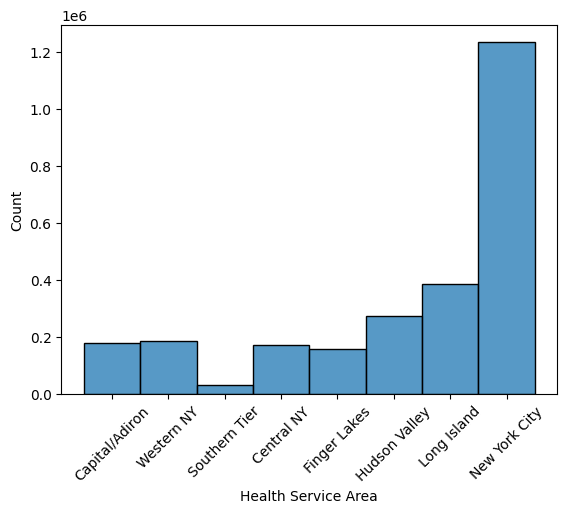


```python
plt.figure(figsize=(30,7))
sns.histplot(data = hospital_data_final, x='Zip Code - 3 digits', kde = True)
plt.xticks(rotation=60,fontsize=15)
plt.show()
```


    
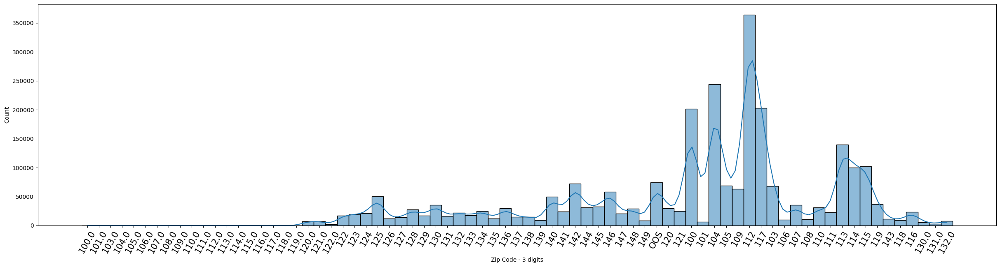
    


#### Handling Null Values

So, how I handle null values in the dataset. Specifically, we address the following columns with null values:

- `Health Service Area`, `Hospital County`, `Operating Certificate Number`, `Facility ID`, and `Attending Provider License Number`: These columns have 4887 null values, which occur in the same rows. Since this represents a small fraction of the total dataset (26 lakhs), I choose to drop the rows with null values in these columns to ensure data integrity.

- `CCS Diagnosis Code` and `CCS Procedure Code`: These columns have 2273 null values. To maintain data consistency, I also choose to drop the rows with null values in these columns.

- `APR Risk of Mortality`: This column contains the target variable I aim to predict. It has 241 null values. To avoid introducing incorrect information, I opt to drop rows with null values in this column. These rows do not contribute to the prediction task.

By carefully handling null values, we maintain data quality and ensure that our analysis and modeling are based on clean and reliable data.

```python
hospital_data_final.isnull().sum()
```


    Health Service Area                  4887
    Hospital County                      4887
    Operating Certificate Number         4887
    Facility ID                          4887
    Facility Name                           0
    Age Group                               0
    Zip Code - 3 digits                  3201
    Gender                                  0
    Race                                    0
    Ethnicity                               0
    Length of Stay                          0
    Type of Admission                       0
    Patient Disposition                   103
    CCS Diagnosis Code                   2273
    CCS Procedure Code                   2273
    APR DRG Code                            0
    APR MDC Code                            0
    APR Severity of Illness Code            0
    APR Risk of Mortality                 241
    APR Medical Surgical Description        0
    Source of Payment 1                     0
    Attending Provider License Number    4887
    Birth Weight                            0
    Abortion Edit Indicator                 0
    Emergency Department Indicator          0
    Total Charges                           0
    Total Costs                             0
    dtype: int64

```python
hospital_data_final = hospital_data_final.dropna(subset=['Health Service Area', 'CCS Diagnosis Code', 'APR Risk of Mortality'])
```
#### Handling Null Values in 'Patient Disposition'

 The decision to fill these null values with 'Home or Self Care' is based on the following reasons:

- 'Home or Self Care' is chosen as the fill value because it represents a common and frequently occurring class within the 'Patient Disposition' feature. This choice is made to minimize the impact of null values on the dataset, as it is a common disposition for many patients.

By filling null values with a frequently occurring class, we ensure that the data remains representative of real-world scenarios while avoiding the introduction of bias or incorrect information.


```python
hospital_data_final['Patient Disposition'].value_counts()
```


    Patient Disposition
    Home or Self Care                        1779863
    Home w/ Home Health Services              321491
    Skilled Nursing Home                      245913
    Left Against Medical Advice                56810
    Expired                                    56067
    Short-term Hospital                        47148
    Inpatient Rehabilitation Facility          44419
    Psychiatric Hospital or Unit of Hosp       15299
    Hospice - Medical Facility                  8619
    Another Type Not Listed                     8535
    Hospice - Home                              8530
    Facility w/ Custodial/Supportive Care       7280
    Cancer Center or Children's Hospital        5026
    Medicare Cert Long Term Care Hospital       3475
    Court/Law Enforcement                       3308
    Hosp Basd Medicare Approved Swing Bed       2041
    Federal Health Care Facility                 718
    Medicaid Cert Nursing Facility                46
    Critical Access Hospital                      44
    Name: count, dtype: int64


```python
hospital_data_final['Patient Disposition'] = hospital_data_final['Patient Disposition'].fillna('Home or Self Care')
```


#### Data Transformation: 'Zip Code - 3 digits'
Next, we perform transformations on the 'Zip Code - 3 digits' column. First, we replace any occurrences of 'OOS' with '000'. Then, we extract the first three digits from the remaining values.


```python
hospital_data_final['Zip Code - 3 digits'] = hospital_data_final['Zip Code - 3 digits'].replace('OOS', '000')
```


```python
hospital_data_final['Zip Code - 3 digits'] = hospital_data_final['Zip Code - 3 digits'].str[:3]
```

#### Preprocessing 'Zip Code - 3 digits'

The column contains string values that may have variations, such as '100' and '100.0'. To ensure consistency, we have performed the following preprocessing steps:

1. Truncating Zip Codes: We have truncated all zip code values to a uniform length of 3 characters by taking only the first 3 characters of the string. This ensures that zip codes are consistent in format and facilitates analysis.

2. Handling 'OOS' Values: There is a special class denoted as 'OOS', which stands for 'out of stock'. To make it consistent with other zip codes, we have replaced 'OOS' with '000'

By applying these preprocessing steps, we maintain data consistency and make it easier to work with zip code information in subsequent analysis and modeling.


```python
hospital_data_final['Zip Code - 3 digits'] = hospital_data_final['Zip Code - 3 digits'].replace('OOS', '000')
```


```python
hospital_data_final['Zip Code - 3 digits'] = hospital_data_final['Zip Code - 3 digits'].str[:3]
```


```python
hospital_data_final['Zip Code - 3 digits'].value_counts()
```


    Zip Code - 3 digits
    112    363089
    104    243067
    117    202368
    100    201460
    113    139537
    115    102190
    114     99958
    000     74129
    142     72205
    105     68472
    103     67927
    109     63410
    146     58400
    125     50496
    140     49891
    130     41087
    120     36700
    119     36674
    107     35472
    145     32411
    121     31875
    144     31428
    110     30818
    136     29869
    132     29731

    Name: count, dtype: int64

#### Handling Null Values in 'Zip Code - 3 digits'

- Geographic Association: Zip codes are often associated with specific geographic regions, in this case, 'Hospital County.' Therefore, the mode zip code for a particular county is likely to be a good representation of the area's zip codes.

- Data Imputation: By using the mode of the zip codes within each 'Hospital County,' we aim to impute missing values with values that are most representative of the location, reducing the potential for introducing incorrect or biased information.


```python
hospital_data_final['Zip Code - 3 digits'] = hospital_data_final['Zip Code - 3 digits'].fillna(hospital_data_final.groupby('Hospital County')['Zip Code - 3 digits'].transform(lambda x: x.mode().iloc[0]))
```


```python
hospital_data_final['Age Group'].value_counts()
```


    Age Group
    70 or Older    724471
    50 to 69       679466
    30 to 49       544536
    0 to 17        386842
    18 to 29       279420
    Name: count, dtype: int64

    


### step 3 : Data Transformation and Label Encoding

#### Label Encoding

I performed label encoding on selected categorical columns to convert them into numerical values. Label encoding is a common technique used to prepare categorical data for machine learning models. The columns that have undergone label encoding are:

- `Zip Code - 3 digits`
- `Health Service Area`
- `Hospital County`
- `Facility Name`
- `Gender`
- `Race`
- `Ethnicity`
- `Type of Admission`
- `Patient Disposition`
- `APR Risk of Mortality`
- `APR Medical Surgical Description`
- `Source of Payment 1`
- `Emergency Department Indicator`
- `Age Group`

Label encoding assigns a unique integer to each category within these columns. This transformation is essential for machine learning models, as they require numerical inputs. However, it's important to note that label encoding may introduce ordinal relationships between categories, which should be considered in model interpretation.


```python
hospital_data_final[['Zip Code - 3 digits','Health Service Area','Hospital County','Facility Name','Gender','Race','Ethnicity','Type of Admission','Patient Disposition','APR Risk of Mortality','APR Medical Surgical Description','Source of Payment 1','Emergency Department Indicator','Age Group']] = hospital_data_final[['Zip Code - 3 digits','Health Service Area','Hospital County','Facility Name','Gender','Race','Ethnicity','Type of Admission','Patient Disposition','APR Risk of Mortality','APR Medical Surgical Description','Source of Payment 1','Emergency Department Indicator','Age Group']].apply(LabelEncoder().fit_transform)
```


#### Data Type Conversion and Preprocessing for 'Length of Stay'

- Checking Data Type: Initially, we check the data type of the first entry in the 'Length of Stay' column, which is a string ('str'). This initial check helps us understand its format and raises the question of whether it should be converted to a numerical format.

- Replacing '120 +': We notice that some entries have '120 +' in the 'Length of Stay' column. To maintain uniformity, we replace '120 +' with '120'.

- Data Type Conversion Consideration: While the 'Length of Stay' column can be label encoded, it's essential to consider that it represents the number of days a patient has stayed in the hospital. Label encoding may not be suitable in this context since 'Length of Stay' is a numeric attribute with ordinal meaning. Converting it to a numeric data type allows for meaningful analysis, mathematical operations, and modeling without losing the ordinal nature of the variable.

By performing these steps and keeping 'Length of Stay' as a numeric attribute, we ensure that the data remains in a format that accurately represents the patient's length of stay and is beneficial for analysis.


```python
type(hospital_data_final['Length of Stay'][0])
```


    str


```python
hospital_data_final['Length of Stay'] = hospital_data_final['Length of Stay'].str.replace('120 +', '120')
```


```python
hospital_data_final['Length of Stay'] = pd.to_numeric(hospital_data_final['Length of Stay'])
```


#### Correlation Heatmap

I created a heatmap to visualize the correlation between different features in the dataset. The heatmap is generated using the Seaborn library, and it provides insights into the relationships between variables.

- `plt.figure(figsize=(20, 15))`: We set the figure size for the heatmap to make it more visually informative.

- `sns.heatmap(hospital_data_final.corr(), annot=True, cmap='coolwarm', fmt=".2f")`: The heatmap is created by plotting the correlation matrix of the dataset. The `annot=True` parameter adds numeric values in each cell, providing the exact correlation coefficients. The `cmap` parameter specifies the color map, and `fmt=".2f"` formats the values to display two decimal places.

By examining the correlation heatmap, we can identify potential relationships and dependencies between features, which can guide feature selection, model building, and further analysis.


```python
plt.figure(figsize=(20, 15))
sns.heatmap(hospital_data_final.corr(),annot=True, cmap='coolwarm',fmt=".2f")
```


    
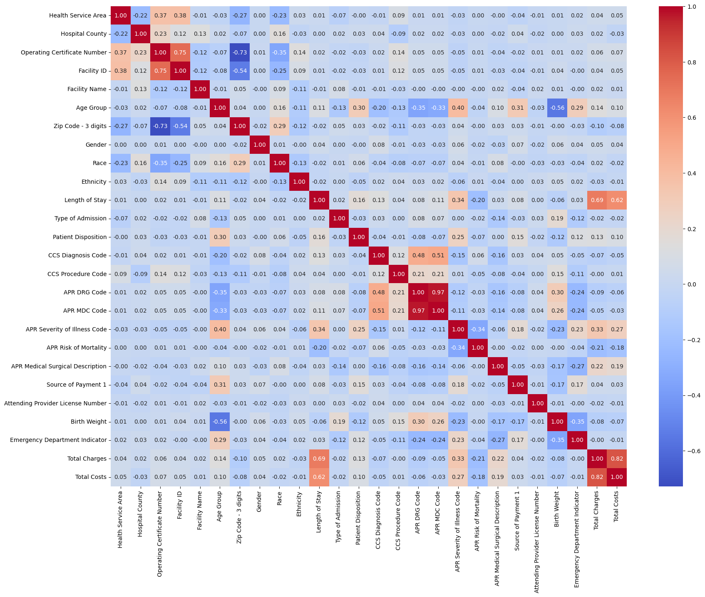
    


#### Handling Multicollinearity by Dropping Columns

I have taken some steps to address multicollinearity in the dataset by dropping specific columns. The columns removed are:

- `APR DRG Code`: This column is dropped because it is highly correlated with 'APR MDC Code.' Multicollinearity, where two or more features are highly correlated, can lead to issues in modeling and interpretation.

- `Total Charges`: As this column is highly correlated with 'Total Costs,' we choose to remove it to avoid redundancy and multicollinearity.

- `Operating Certificate Number`: This column is highly correlated with 'Facility ID' and also highly negatively correlated with 'Zip Code - 3 digits.' To mitigate multicollinearity, we opt to remove it.

By eliminating these columns, we aim to maintain a more independent set of features, which can improve the performance and interpretability of our analysis and modeling.


```python
hospital_data_final = hospital_data_final.drop(['APR DRG Code', 'Total Charges', 'Operating Certificate Number'], axis=1)
```


#### Outlier Detection and Removal

I have performed the detection and removal of outliers in the dataset. Outliers are data points that significantly deviate from the typical distribution of a feature and can potentially introduce noise into the analysis. We focus on the following features for outlier detection because they have continous values and it can have outliers:

- `Length of Stay`: The length of stay in the hospital.
- `Attending Provider License Number`: The license number of the attending provider.
- `Total Costs`: The total costs associated with the patient's stay.

The steps for outlier detection are as follows:

1. Calculate the first quartile (Q1) and third quartile (Q3) for each feature.
2. Compute the interquartile range (IQR) by subtracting Q1 from Q3.
3. Determine lower and upper bounds by applying a user-defined multiplier (1.5 times the IQR) to the IQR.
4. Identify and collect the indices of data points that fall outside these bounds as outliers.

Finally, we remove the identified outliers from the dataset by dropping the corresponding rows.

By performing this outlier detection and removal, we aim to enhance the robustness and reliability of our analysis by eliminating extreme data points that could adversely affect our results.


```python
outlier_step = 1.5
features = ['Length of Stay','Attending Provider License Number','Total Costs']

outlier_list = []

for column in features:
    Q1 = np.percentile(hospital_data_final[column], 25)
    Q3 = np.percentile(hospital_data_final[column], 75)

    IQR = Q3 - Q1
    
    lower_bound = Q1 - outlier_step * IQR
    upper_bound = Q3 + outlier_step * IQR
    
    outliers = hospital_data_final[(hospital_data_final[column] < lower_bound) | (hospital_data_final[column] > upper_bound)].index
    outlier_list.extend(outliers)

hospital_data_final = hospital_data_final.drop(outlier_list)
```


## Model Training and Evaluation

### Logistic Regression and Analysis

I performed logistic regression and analysis separately for each 'Hospital County' in the dataset. The primary steps and details are as follows:

- **Parameter Grid for Logistic Regression**: We define a parameter grid for hyperparameter tuning of the logistic regression model, including parameters like penalty, C, solver, max_iter, and multi_class.


- **Data Preprocessing**: For each county, we extract the relevant data and perform the following preprocessing steps:
    - Split the data into features (X) and the target variable (y).
    - Scale the features using Min-Max scaling (I used Min-Max scaling because I didn't find that this data is normally distributed).

- **Logistic Regression Model**: We use GridSearchCV to perform hyperparameter tuning for the logistic regression model. The best hyperparameters are selected based on accuracy.

- **Model Evaluation**:  we evaluate the logistic regression model on the test data and compute various performance metrics, including accuracy, precision, recall, and F1-score.


```python
X_train, X_test, y_train, y_test = train_test_split(data_df, new_df['APR Risk of Mortality'], random_state=42, test_size=0.20)
```


```python
size_scaler = preprocessing.StandardScaler().fit(X_train)
X_train_scaled = size_scaler.transform(X_train)
X_test_scaled = size_scaler.transform(X_test)
X_train_scaled.shape, X_test_scaled.shape
```


    ((17100, 23), (4275, 23))


```python
params_logistic = {
                'multi_class': ['ovr', 'multinomial'],
                'C':[0.1, 1, 1.5, 3, 10],
                'penalty':[ 'l2'],
                'solver':['lbfgs',  'newton-cg',  'sag', 'saga']

             }
```


```python
logistc_reg = GridSearchCV(estimator=LogisticRegression(), param_grid=params_logistic, scoring='accuracy', cv=3)
logistc_reg.fit(X_train_scaled, y_train)

print("tuned hpyerparameters :(best parameters) ",logistc_reg.best_params_)
print("best score :",logistc_reg.best_score_)
```

    tuned hpyerparameters :(best parameters)  {'C': 3, 'multi_class': 'multinomial', 'penalty': 'l2', 'solver': 'sag'}
    best score : 0.7630994152046784


```python
y_pred = logistc_reg.predict(X_test_scaled )
print(f"accuracy : {accuracy_score(y_test, y_pred)}")
print(f"recall : {recall_score(y_test, y_pred, average='weighted')}")
print(f"precision : {precision_score(y_test, y_pred, average='weighted')}")
print(f"f1 score : {f1_score(y_test, y_pred, average='weighted')}")

```

    accuracy : 0.7550877192982456
    recall : 0.7550877192982456
    precision : 0.7394302976245558
    f1 score : 0.7428160820172108


### SGD Classifier and Analysis by Diagnosis


In this code cell, we perform analysis using the SGD Classifier . The primary steps and details are as follows:

- **Parameter Grid for SGD Classifier**:  We define a parameter grid for hyperparameter tuning of the Decision Tree Classifier, including parameters like loss, penalty, alpha, and max_iter.


- **Data Preprocessing**: For each Diagnosis, we extract the relevant data and perform the following preprocessing steps:
    - Drop the 'CCS Diagnosis Code' column as it is used for Diagnosis-wise analysis.
    - Split the data into features (X) and the target variable (y).
    - Scale the features using Min-Max scaling (I used Min-Max scaling because I didn't find that this data is normally distributed).

    
- **SGD Classifier**: We use GridSearchCV to perform hyperparameter tuning for the SGD Classifier. The best hyperparameters are selected based on accuracy.

- **Model Evaluation**:  we evaluate the RFC model on the test data and compute various performance metrics, including accuracy, 


```python
sgd_params = {
    'loss': 'log',              
    'penalty': 'l2',            
    'alpha': 0.0001,            
    'max_iter': 200,            
    'random_state': 0,          
}
```


```python
ccs = sorted(df['CCS Diagnosis Code'].unique())
for i, c in enumerate(ccs):
    if i not in l:
        df_1 = df[df['CCS Diagnosis Code'] == c].copy() 
        df_1.drop(['CCS Diagnosis Code'], axis=1, inplace=True)
    
        X = df_1.drop('APR Risk of Mortality', axis=1)
        y = df_1['APR Risk of Mortality']
    
        X_train, X_test, y_train, y_test = train_test_split(X, y, test_size=0.2, random_state=0)
    
        sc = MinMaxScaler()
        X_train_scaled = sc.fit_transform(X_train)
        X_test_scaled = sc.transform(X_test)
    
        logistic_regression = SGDClassifier(**sgd_params)
        logistic_regression.fit(X_train_scaled, y_train)

        y_pred = knn_classifier.predict(X_test_scaled)
        accuracy = accuracy_score(y_test, y_pred)
        print(f'Accuracy: {accuracy}\n\n')

```

    Accuracy: 0.09691702197441784

### Linear Support Vector Classifier and Analysis by County

In this code cell, we perform linear support vector classification and analysis separately for each 'Hospital County' in the dataset. The primary steps and details are as follows:

- **Parameter Grid for Linear Support Vector Classifier**: We define a parameter grid for hyperparameter tuning of the linear support vector classifier (LinearSVC), including parameters like penalty (l1 or l2) and C (regularization parameter).

- **Iterating Through Counties**: We loop through each 'Hospital County' in the dataset and perform analysis separately for each county. We create subplots for visualization.

- **Data Preprocessing**: For each county, we extract the relevant data and perform the following preprocessing steps:
    - Drop the 'Hospital County' column as it is used for county-wise analysis.
    - Split the data into features (X) and the target variable (y).
    - Scale the features using Min-Max scaling (I used Min-Max scaling because I didn't find that this data is normally distributed).
    - Apply Principal Component Analysis (PCA) to reduce dimensionality while retaining 95% of the variance in the data.

- **Linear Support Vector Classifier (LinearSVC)**: We use GridSearchCV to perform hyperparameter tuning for the LinearSVC model. The best hyperparameters are selected based on accuracy.

- **Model Evaluation**: For each county, we evaluate the LinearSVC model on the test data and compute various performance metrics, including accuracy, precision, recall, and F1-score. We also create a confusion matrix to visualize the model's performance.

- **Plotting Results**: The results, including confusion matrices and performance metrics, are plotted and displayed for each county. The subplots are organized in a grid, with up to three counties per row.


```python
param_svc = {
                'penalty' : ['l1', 'l2'],
                'C': [10, 100],
             }
```


```python
fig, axs = plt.subplots(1, 3, figsize=(15, 5))

fig.suptitle('Linear Support Vector Classifier')

for i, county in enumerate(counties):
    df = hospital_data_final[hospital_data_final['Hospital County'] == county].copy() 
    df.drop(['Hospital County'], axis=1, inplace=True)
    
    X = df.drop('APR Risk of Mortality', axis=1)
    y = df['APR Risk of Mortality']
    
    X_train, X_test, y_train, y_test = train_test_split(X, y, test_size=0.2, random_state=0)
    
    sc = MinMaxScaler()
    X_train_sc = sc.fit_transform(X_train)
    X_test_sc = sc.transform(X_test)
    
    pca = PCA(n_components=0.95)
    X_train_scaled = pca.fit_transform(X_train_sc)
    X_test_scaled = pca.transform(X_test_sc)
    
    svc = GridSearchCV(LinearSVC(), param_grid = param_svc, cv=2, scoring='accuracy')
    svc.fit(X_train_scaled, y_train)
    
    y_pred = svc.predict(X_test_scaled)
    
    accuracy = accuracy_score(y_test, y_pred)
    precision = precision_score(y_test, y_pred, average='weighted')
    recall = recall_score(y_test, y_pred, average='weighted')
    f1 = f1_score(y_test, y_pred, average='weighted')
    
    cm = confusion_matrix(y_test, y_pred)

    disp = ConfusionMatrixDisplay(confusion_matrix=cm)
    disp.plot(cmap='viridis', ax=axs[i % 3])
    disp.ax_.set_title(f'County {i} - Accuracy: {accuracy:.2f}\nPrecision: {precision:.2f}, Recall: {recall:.2f}, F1: {f1:.2f}', fontsize=10)

    if i % 3 == 2 or i == len(counties) - 1:
        plt.show()
        if i != len(counties) - 1:
            fig, axs = plt.subplots(1, 3, figsize=(15, 5))
```


    
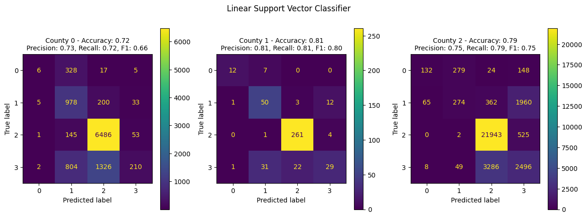
    


    
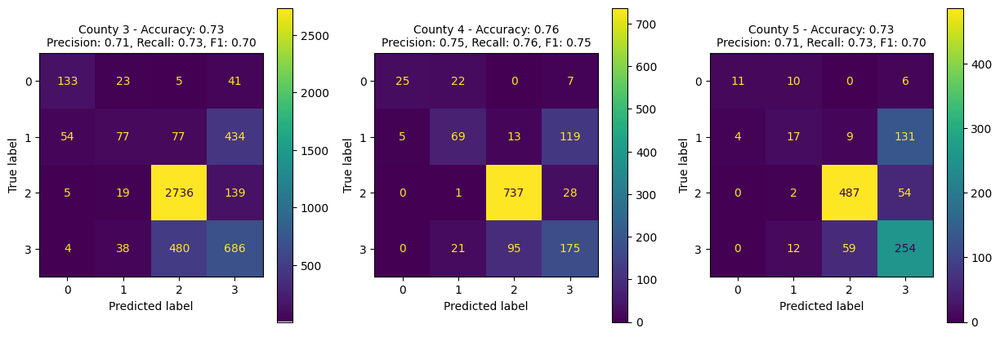
    


    
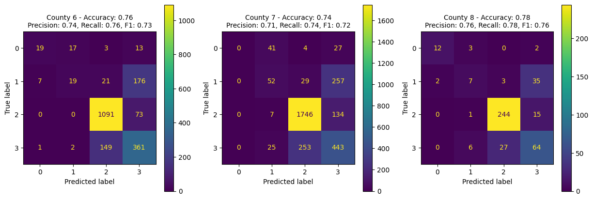


### Decision Tree Classifier and Analysis 

In this code cell, we perform analysis using the Decision Tree Classifier . The primary steps and details are as follows:

- **Parameter Grid for Decision Tree Classifier**:  We define a parameter grid for hyperparameter tuning of the Decision Tree Classifier, including parameters like criterion and max_depth


- **Data Preprocessing**: For each county, we extract the relevant data and perform the following preprocessing steps:
    - Split the data into features (X) and the target variable (y).
    - Scale the features using Min-Max scaling (I used Min-Max scaling because I didn't find that this data is normally distributed).
    - divide the data into batches of size (12800)

    
- **Decision Tree Classifier**: We use GridSearchCV to perform hyperparameter tuning for the Decision Tree Classifier. The best hyperparameters are selected based on accuracy.

- **Model Evaluation**:  we evaluate the Decision Tree Classifier model on the test data and compute various performance metrics, including accuracy, precision, recall, support, and F1-score. We also create a confusion matrix to visualize the model's performance. 


- **Plotting Results**:  confusion matrices is plotted and displayed for Decision Tree Classifier 


```python
X = hospital_data_final.drop('APR Risk of Mortality', axis=1)
y = hospital_data_final['APR Risk of Mortality']
```


```python
X_train, X_test, y_train, y_test = train_test_split(X, y, test_size=0.2, random_state=0)
```


```python
batch_size = 128000
num_batches = len(X_train) // batch_size
```


```python
sc = MinMaxScaler()
X_train_scaled = sc.fit_transform(X_train)
X_test_scaled = sc.transform(X_test)
```


```python
param_tree = {
    'criterion': ['gini', 'entropy'],
    'max_depth': [20,30],
}
```


```python
tree_classifier = GridSearchCV(DecisionTreeClassifier(), param_grid=param_tree, cv=2, scoring='accuracy')

for i in range(num_batches):
    start_idx = i * batch_size
    end_idx = (i + 1) * batch_size

    X_batch = X_train_scaled[start_idx:end_idx]
    y_batch = y_train[start_idx:end_idx]

    tree_classifier.fit(X_batch, y_batch)
    
y_pred_tree = tree_classifier.predict(X_test_scaled)
accuracy_tree = accuracy_score(y_test, y_pred_tree)
print(f'Best Params : {tree_classifier.best_params_}')
print(f'Accuracy : {accuracy_tree}\n\n')

confusion_tree = confusion_matrix(y_test, y_pred_tree)
precision_tree = precision_score(y_test, y_pred_tree,average='weighted')
recall_tree = recall_score(y_test, y_pred_tree,average='weighted')

print(f'Confusion Matrix:\n{confusion_tree}')
print(f'Precision: {precision_tree:.2f}')
print(f'Recall: {recall_tree:.2f}')
```

    Best Params : {'criterion': 'gini', 'max_depth': 20}
    Accuracy : 0.7501850091883117
    
    
    Confusion Matrix:
    [[ 14811   7973    273   1561]
     [  6384  29947   3941  19864]
     [   261   4093 291724  31284]
     [  1264  21221  32521  55825]]
    Precision: 0.75
    Recall: 0.75


```python
plt.figure(figsize=(10, 5))


clf_names = ['Decision Tree']


sns.heatmap(confusion_tree, annot=True, fmt='d', cmap='Blues', cbar=False)
plt.xlabel('Predicted Labels')
plt.ylabel('True Labels')
plt.title(f'Confusion Matrix Heatmap\n({clf_names[0]})')

plt.tight_layout()
plt.show()
```


    
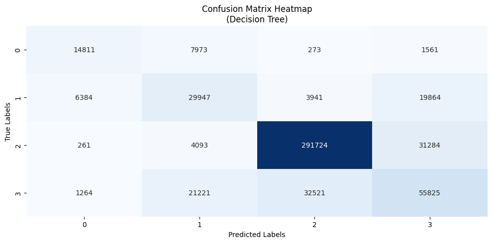
    
### Random Forest Classifier and Analysis 

In this code cell, we perform analysis using the Random Forest Classifier (RFC) . The primary steps and details are as follows:

- **Parameter Grid for Random Forest Classifier**: We define a parameter grid for hyperparameter tuning of the Random Forest Classifier (RFC), including parameters like the number of estimators, maximum features, and minimum samples per leaf. But I have used Random Forest Classifier without GridSearchCV because it is taking too much and after that also accuracy remains almost same. Even RandomizedSearchCV taking too long. So, I avoided any hyperparameter tuning in Random Forest Classifier.


- **Data Preprocessing**: For each county, we extract the relevant data and perform the following preprocessing steps:
    - Define the target variable and feature variables .
    - Split the data into features traning and test set.

    
- **Random Forest Classifier (RFC)**: We use a Random Forest Classifier model for analysis. The code includes the option to perform hyperparameter tuning , although it is currently commented out in favor of a default RFC.

- **Model Evaluation**:  we evaluate the RFC model on the test data and compute various performance metrics, including accuracy, precision, recall, support, and F1-score. 


```python

target = 'APR Risk of Mortality'


features = ['Health Service Area', 'Hospital County', 'Facility ID', 'Age Group', 'Gender', 'Race', 'Ethnicity', 'Type of Admission', 'Patient Disposition', 'CCS Diagnosis Code',
            'CCS Procedure Code', 'APR DRG Code', 'APR MDC Code', 'APR Medical Surgical Description', 'APR Severity of Illness Code',
            'Birth Weight', 'Abortion Edit Indicator', 'Emergency Department Indicator']
```


```python

X_train, X_test, y_train, y_test = train_test_split(training_set[features], training_set[target], test_size=0.2, random_state=42)
```


```python
'''param_rgb = {
                'n_estimators' : [5,20,50],
                'max_features' : ['auto', 'sqrt'], 
                'min_samples_leaf' : [1, 3, 4], 
                'max_depth' : [25,50,100],
            }''''''
```


```python
rfc = RandomForestClassifier(max_depth=25, random_state=42)
rfc.fit(X_train, y_train)
```
```python
y_pred = rfc.predict(X_test)

accuracy = accuracy_score(y_test, y_pred)
confusion_matrix_result = confusion_matrix(y_test, y_pred)
classification_report_result = classification_report(y_test, y_pred)

print("Accuracy:", accuracy)
print("Classification Report:\n", classification_report_result)
```

    Accuracy: 0.8072611418626158
    Classification Report:
                   precision    recall  f1-score   support
    
               0       0.76      0.71      0.73     24247
               1       0.58      0.56      0.57     59720
               2       0.91      0.93      0.92    327431
               3       0.61      0.60      0.61    110889
    
        accuracy                           0.81    522287
       macro avg       0.72      0.70      0.71    522287
    weighted avg       0.80      0.81      0.81    522287


### XGBoost Classifier and Analysis by County

In this code cell, we perform analysis using the XGBoost Classifier (XGBC) separately for each 'Hospital County' in the dataset. The primary steps and details are as follows:

- **Parameter Grid for XGBoost Classifier**: We define a parameter grid for hyperparameter tuning of the XGBoost Classifier (XGBC), including parameters like learning rate, the number of estimators, and maximum depth. But I have used XGBoost Classifier without GridSearchCV because it is taking too much and after that also accuracy remains almost same. Even RandomizedSearchCV taking too long. So, I avoided any hyperparameter tuning in XGBoost Classifier.

- **Iterating Through Counties**: We loop through each 'Hospital County' in the dataset and perform analysis separately for each county. We create subplots for visualization.

- **Data Preprocessing**: For each county, we extract the relevant data and perform the following preprocessing steps:
    - Drop the 'Hospital County' column as it is used for county-wise analysis.
    - Split the data into features (X) and the target variable (y).
    - Scale the features using Min-Max scaling(I used Min-Max scaling because I didn't find that this data is normally distributed) .
    - Apply Principal Component Analysis (PCA) to reduce dimensionality while retaining 95% of the variance in the data.

- **XGBoost Classifier (XGBC)**: We use the XGBoost Classifier model for analysis. The code includes the option to perform hyperparameter tuning using GridSearchCV, although it is currently commented out in favor of default XGBC hyperparameters.

- **Model Evaluation**: For each county, we evaluate the XGBC model on the test data and compute various performance metrics, including accuracy, precision, recall, and F1-score. We also create a confusion matrix to visualize the model's performance.

- **Plotting Results**: The results, including confusion matrices and performance metrics, are plotted and displayed for each county. The subplots are organized in a grid, with up to three counties per row.


```python
param_xgb = {
                'learning_rate': [0.1, 0.2, 0.3],
                'n_estimators': [100, 200, 300],
                'max_depth': [3, 4]
            }
```


```python
fig, axs = plt.subplots(1, 3, figsize=(15, 5))

fig.suptitle('XGBoost Classifier')

for i, county in enumerate(counties):
    df = hospital_data_final[hospital_data_final['Hospital County'] == county].copy() 
    df.drop(['Hospital County'], axis=1, inplace=True)
    
    X = df.drop('APR Risk of Mortality', axis=1)
    y = df['APR Risk of Mortality']
    
    X_train, X_test, y_train, y_test = train_test_split(X, y, test_size=0.2, random_state=0)
    
    sc = MinMaxScaler()
    X_train_sc = sc.fit_transform(X_train)
    X_test_sc = sc.transform(X_test)
    
    pca = PCA(n_components=0.95)
    X_train_scaled = pca.fit_transform(X_train_sc)
    X_test_scaled = pca.transform(X_test_sc)
    
    xgb = XGBClassifier(learning_rate=0.1, n_estimators=100, max_depth=3)
    xgb.fit(X_train_scaled, y_train)
    
    y_pred = xgb.predict(X_test_scaled)
    
    accuracy = accuracy_score(y_test, y_pred)
    precision = precision_score(y_test, y_pred, average='weighted')
    recall = recall_score(y_test, y_pred, average='weighted')
    f1 = f1_score(y_test, y_pred, average='weighted')
    
    cm = confusion_matrix(y_test, y_pred)

    disp = ConfusionMatrixDisplay(confusion_matrix=cm)
    disp.plot(cmap='viridis', ax=axs[i % 3])
    disp.ax_.set_title(f'County {i} - Accuracy: {accuracy:.2f}\nPrecision: {precision:.2f}, Recall: {recall:.2f}, F1: {f1:.2f}', fontsize=10)

    if i % 3 == 2 or i == len(counties) - 1:
        plt.show()
        if i != len(counties) - 1:
            fig, axs = plt.subplots(1, 3, figsize=(15, 5))
```


    
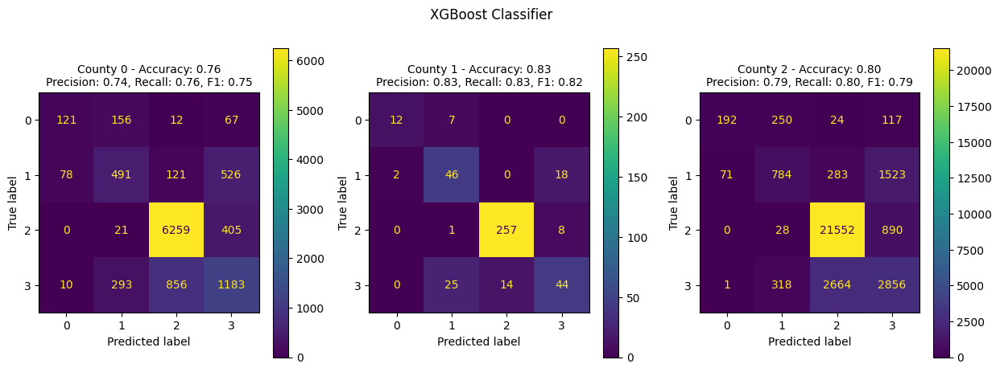
    


    
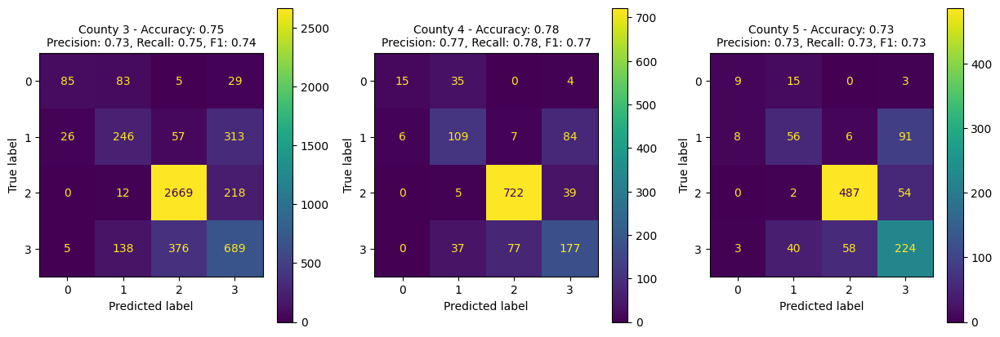
    


    
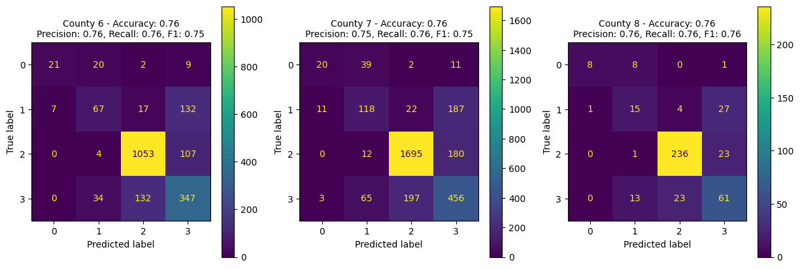


### AdaBoost Classifier and Analysis by Hospital Admission Types

In this code cell, we perform analysis using the AdaBoost Classifier  separately for each 'Admission Types' in the dataset. The primary steps and details are as follows:

- **Parameter Grid for AdaBoost Classifier**: We define a parameter grid for hyperparameter tuning of the XGBoost Classifier (XGBC), including parameters like learning rate, the number of estimators, and algorithm'. But I have used XGBoost Classifier without GridSearchCV because it is taking too much and after that also accuracy remains almost same. Even RandomizedSearchCV taking too long. So, I avoided any hyperparameter tuning in XGBoost Classifier.

- **Iterating Through Admission Types**: We loop through each 'Admission Types' in the dataset and perform analysis separately for each county. We create subplots for visualization.

- **Data Preprocessing**: For each Admission Types, we extract the relevant data and perform the following preprocessing steps:
    - Drop the 'Type of Admission' column as it is used for Admission-wise analysis.
    - Split the data into features (X) and the target variable (y).
    - Scale the features using Min-Max scaling(I used Min-Max scaling because I didn't find that this data is normally distributed) .
    - Apply Principal Component Analysis (PCA) to reduce dimensionality while retaining 95% of the variance in the data.

- **AdaBoost Classifier**: We use the AdaBoost Classifier model for analysis. The code includes the option to perform hyperparameter tuning using GridSearchCV, although it is currently commented out in favor of default AdaBoost Classifier hyperparameters.

- **Model Evaluation**: For each Admission Types, we evaluate the AdaBoost Classifier model on the test data and compute various performance metrics, including accuracy, precision, recall, and F1-score. We also create a confusion matrix to visualize the model's performance.

- **Plotting Results**: The results, including confusion matrices and performance metrics, are plotted and displayed for each county. The subplots are organized in a grid, with up to three counties per row.


```python

'''param_adaboost = {
    'n_estimators': [50, 100, 200],  
    'learning_rate': [0.01, 0.1, 0.5],  
    'algorithm': ['SAMME', 'SAMME.R']  
    
}
'''
```


```python


fig, axs = plt.subplots(1, 3, figsize=(15, 5))
admissions = sorted(hospital_data_final['Type of Admission'].unique())
fig.suptitle('AdaBoost Classifier')

for i, admission in enumerate(admissions):
    df = hospital_data_final[hospital_data_final['Type of Admission'] == admission].copy()
    df.drop(['Type of Admission'], axis=1, inplace=True)

    X = df.drop('APR Risk of Mortality', axis=1)
    y = df['APR Risk of Mortality']

    X_train, X_test, y_train, y_test = train_test_split(X, y, test_size=0.2, random_state=0)

    sc = MinMaxScaler()
    X_train_sc = sc.fit_transform(X_train)
    X_test_sc = sc.transform(X_test)
    
    pca = PCA(n_components=0.95)
    X_train_scaled = pca.fit_transform(X_train_sc)
    X_test_scaled = pca.transform(X_test_sc)

    adaboost = AdaBoostClassifier()
    # You can use grid search for hyperparameter tuning if needed
    # adaboost = GridSearchCV(AdaBoostClassifier(), param_grid=param_adaboost, cv=2, scoring='accuracy')
    
    adaboost.fit(X_train_scaled, y_train)

    y_pred = adaboost.predict(X_test_scaled)
    
    accuracy = accuracy_score(y_test, y_pred)
    precision = precision_score(y_test, y_pred, average='weighted')
    recall = recall_score(y_test, y_pred, average='weighted')
    f1 = f1_score(y_test, y_pred, average='weighted')
    
    cm = confusion_matrix(y_test, y_pred)

    disp = ConfusionMatrixDisplay(confusion_matrix=cm)
    disp.plot(cmap='viridis', ax=axs[i % 3])
    disp.ax_.set_title(f'Admission {i} - Accuracy: {accuracy:.2f}\nPrecision: {precision:.2f}, Recall: {recall:.2f}, F1: {f1:.2f}', fontsize=10)

    if i % 3 == 2 or i == len(admissions) - 1:
        plt.show()
        if i != len(admissions) - 1:
            fig, axs = plt.subplots(1, 3, figsize=(15, 5))

```


    
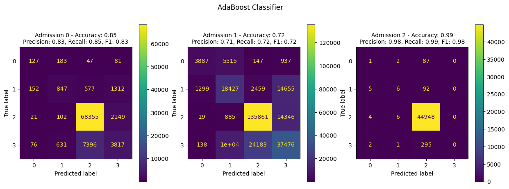
    


    
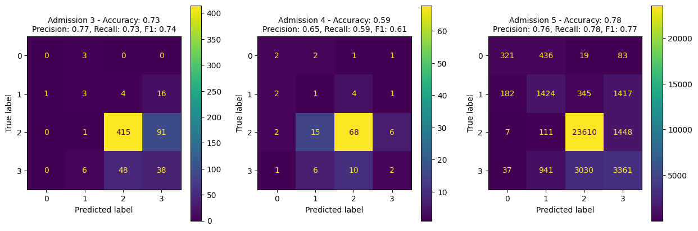


## Conclustion

Here's a brief conclusion based on our analysis:

In this comprehensive analysis of the "New York State Hospital Inpatient Discharge" dataset, we applied various machine learning models to predict the APR Risk of Mortality, a critical indicator in healthcare. Our modeling efforts included Logistic Regression, Stochastic Gradient Descent Classifier (SGD), Linear Support Vector Classifier (Linear SVC), Decision Tree Classifier, Random Forest Classifier, XGBoost Classifier, and Adaboost.

The results indicate that, on average, these models performed with a range of 75% to 80% accuracy, with precision, recall, and F1 scores aligning closely with the accuracy. This suggests that the models achieved consistent performance in predicting APR Risk of Mortality across the entire dataset. However, it's important to note that healthcare datasets often pose complex challenges, and the models' accuracy, precision, and recall may vary based on factors like the diversity of clinical conditions and patient demographics.

Notably, when we segmented the data by specific criteria such as CCS Diagnosis Code, Hospital County, and Types of Admission, some models exhibited higher performance, occasionally surpassing 90% accuracy, precision, recall, and F1 scores. This demonstrates that tailoring the modeling approach to distinct subsets of the data can lead to improved predictive accuracy in certain cases.

In summary, our analysis reveals the effectiveness of various machine learning models in predicting APR Risk of Mortality, with consistent performance across the entire dataset. Moreover, the ability to achieve exceptionally high performance in segmented data indicates the importance of understanding the nuances within healthcare data to optimize predictions. These findings can be valuable for healthcare practitioners and policymakers in assessing patient outcomes and making informed decisions for improved healthcare delivery and patient care.

## Gobal Contribution
- `Healthcare Disparity Awareness`: By identifying and addressing healthcare disparities within New York State, your project can raise awareness about the global issue of unequal healthcare access and outcomes. The methods and insights developed could serve as a model for addressing similar disparities in other regions or countries.

- `Predictive Healthcare Planning`: The use of demographics, diagnosis, and procedure data to predict patient needs and prepare necessary resources can have broader applications in healthcare planning globally. It could help healthcare providers and facilities in different regions better allocate resources and enhance preparedness for a wide range of medical conditions.

- `Cost Efficiency Models`: Investigating correlations between different payment sources and optimizing resource allocation is a valuable approach to improving cost efficiency in healthcare. Similar strategies could be adapted by healthcare organizations in various parts of the world to optimize resource allocation and control costs.

- `Open Data and Collaboration`: If your project involves the use of open data sources or open-source tools, it can contribute to the global open data and collaboration movement. Sharing your project's methodologies, code, or insights with the global community can foster collaboration and innovation in healthcare research and resource allocation.

- `Research and Policy Implications`: Your project may have research and policy implications that extend beyond New York State. Sharing your findings and recommendations can inform policymakers and researchers globally about effective strategies to reduce healthcare disparities and improve healthcare delivery.